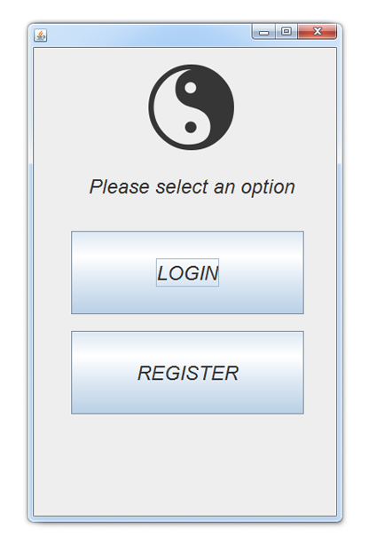
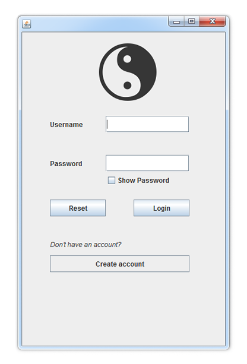
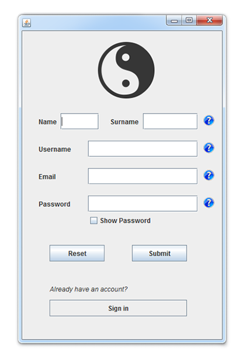
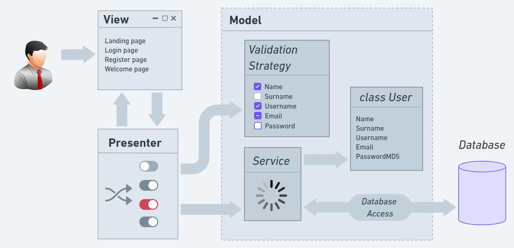
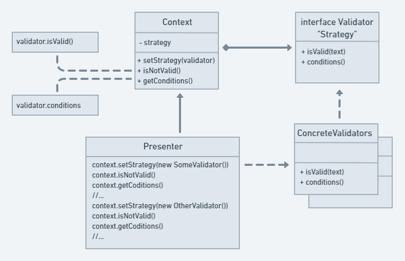

# Login and Registration

Implementation of a simple secure login and registration forms with menu, using Java Swing Application Framework. All data is written to the database [file](data/database.txt). Password encryption using MD5 algorithm.
 

</img>  
</img> 
</img> 
</img>

 

## Design Patterns

- Model View Presenter (MVP)
- Strategy Pattern

## MVP

 

</img>

 

## Strategy pattern

 

</img>

 